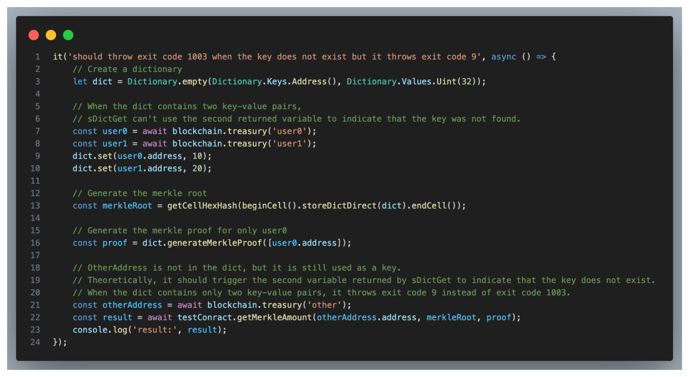
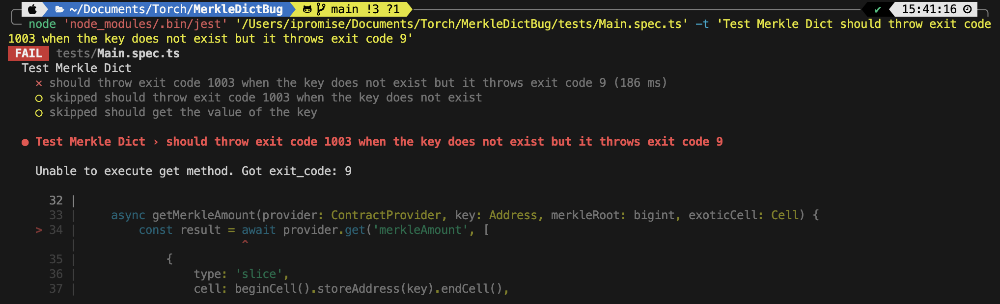
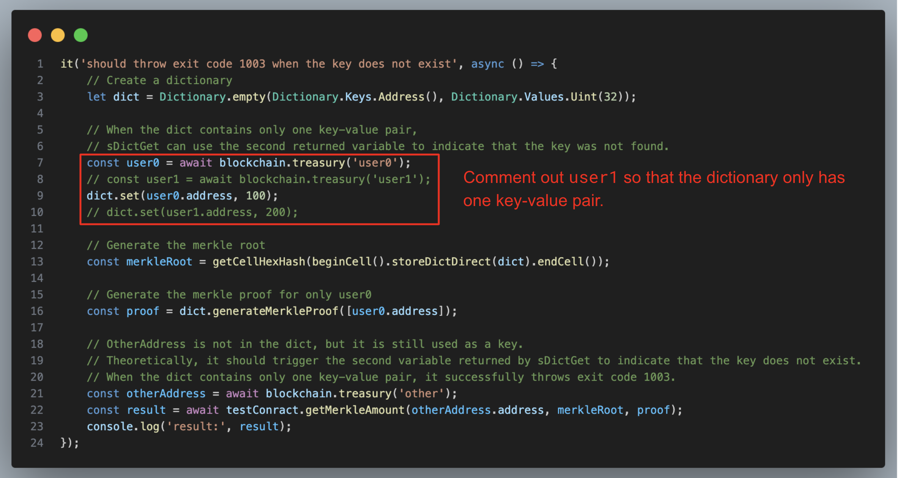
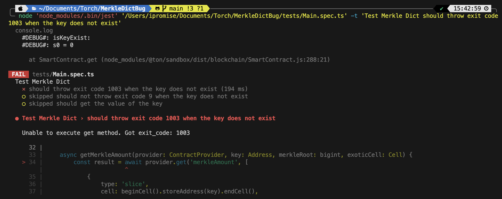
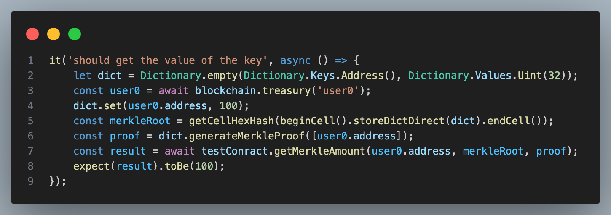
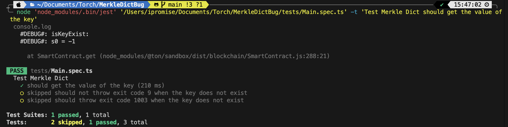

# MerkleDictBug

## Background

While using **Tolk** to write code for parsing exotic cells and verifying the Merkle root before retrieving data from a dictionary, I discovered an unusual issue. When the specified key does not exist in the dictionary, and the dictionary contains more than one key-value pair, the function prematurely throws **exit code 9** instead of returning `0` or `-1` via the second parameter of `sDictGet` to indicate whether the key exists in the dictionary.

This inconsistency in the error behavior and its deviation from the `sDictGet` specification makes it difficult for users to handle errors properly.

## Description

Here, I will explain my experimental process. First, I wrote a smart contract and tested it using the `merkleAmount()` get-method. The `merkleAmount` function takes three parameters: `key: slice`, `merkleRoot: int`, and `exoticCell: cell`. The function parses the `exoticCell`, verifies the Merkle root, and retrieves the `merkleDict`. It then uses the `key` variable to check whether the key exists in the `merkleDict`. If the key does not exist, the function throws `ERROR_KEY_NOT_EXIST` (exit code 1003). If the key exists, the corresponding value is returned. The code can be seen in the snippet below:


### Test Process:

1. **First Test**:  
   In the first test, I created a dictionary and added two entries: `user0` and `user1`. A Merkle root and `user0`'s Merkle proof were generated. Then, I tested with an `otherAddress` that does not exist in the dictionary.  
   Expected behavior: Since `otherAddress` is not in the dictionary, `sDictGet` should return `isKeyExist = 0`. This value would then trigger the assert statement `assert(isKeyExist, ERROR_KEY_NOT_EXIST);`, resulting in `ERROR_KEY_NOT_EXIST` being thrown.  
   Actual result: Before `sDictGet` could return its result, the function prematurely threw **exit code 9**, which did not match the expected behavior.  

   **Test Code:**
   

   **Result:**
   

2. **Second Test**:  
   In this test, I modified the first test by removing `user1` from the dictionary. Using the same `otherAddress` for testing, the function correctly returned `isKeyExist = 0` from `sDictGet`, allowing the assert statement to successfully throw `ERROR_KEY_NOT_EXIST` (exit code 1003).

   **Test Code:**
   

   **Result:**
   

3. **Third Test**:  
   This test confirmed that when the key exists in the dictionary, the function correctly retrieves and returns the associated value.

   **Test Code:**
   

   **Result:**
   

## How to use

```
corepack enable
corepack prepare yarn@4.5.0 --activate
yarn install
yarn test
```

# MerkleDictBug
